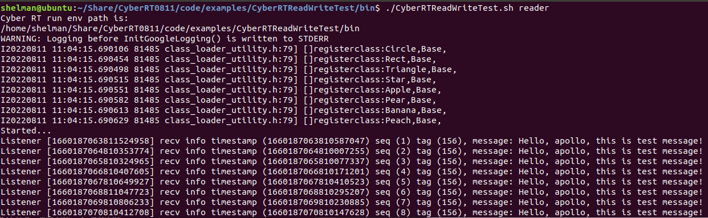
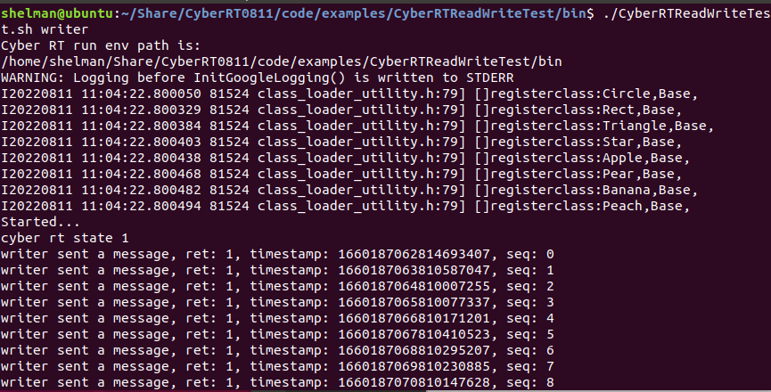

# Apollo(v7.0.0) Cyber 
基本编译参考：https://gitee.com/langxm2006/cyber-rt
该项目整个编译整理的比较详细，我主要是采用镜像和脚本封装了一层，并解决了我在操作中遇到的问题

## #1 编译环境

```shell
Ubuntu20.04
```
采用下面的命令得到一个docker 镜像，所有的编译以及验证流程都是在镜像对应的容器中完成的
```shell
docker build -f ./DockerFile -t cyber_rt_build:0.1 .
```


## #2 build and install
```bash
git clone 项目.git # 克隆项目
docker run -v [项目全局路径]:[项目全局路径] -it  cyber_rt_build:0.1 /bin/bash # 创建容器
cd [项目全局路径]
./auto_build.sh # 开始编译
```


## #3 验证

```shell
cd code/examples/CyberRTReadWriteTest/bin
sudo chmod +x CyberRTReadWriteTest.sh
```

运行reader
```shell
./CyberRTReadWriteTest.sh reader
```


运行writer
```shell
./CyberRTReadWriteTest.sh writer
```



